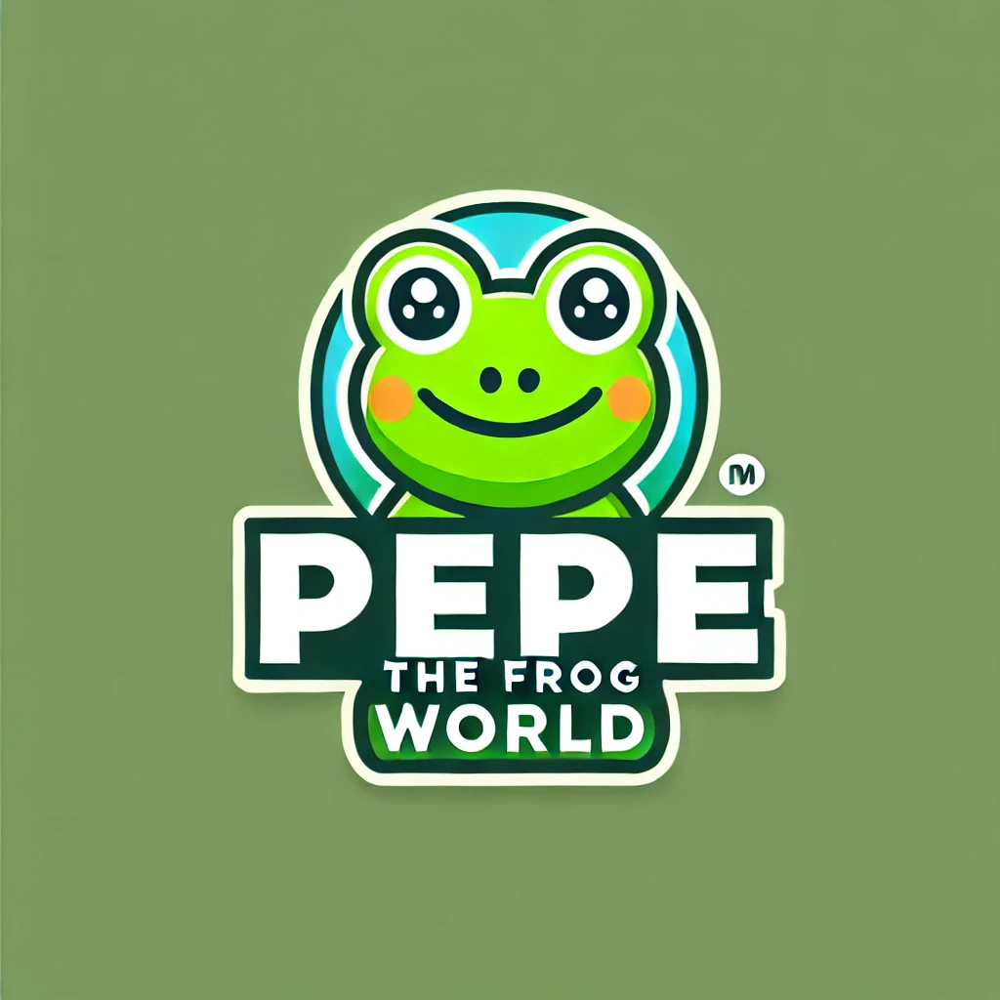

# PEPE THE FROG WORLD

## 페페 밈을 이용한 다양한 프로젝트들이 있습니다.

_다른 언어: [English](README.md), [한국어](README.ko.md)_



## 프로젝트 목록

#### [Don't Click](https://love1ace.github.io/pepe-world/projects/dontclick/index.html)
절대 이 웹사이트 안에 있는 버튼을 클릭하지 마세요!!

#### [PepeDinoGame](https://love1ace.github.io/pepe-world/projects/pepedinogame/dino.html)
크롬 공룡 점프 게임을 패러디한 페페 공룡 점프 게임입니다.

#### [PepeGPT](https://love1ace.github.io/pepe-world/projects/pepegpt/index.html)
페페 밈을 이용한 AI 챗봇입니다. 이 프로젝트는 CatGPT의 패러디입니다.

#### [PepeCardGame](https://love1ace.github.io/pepe-world/projects/PepeCardGame/MemoryCardGame.html)
페페 밈을 이용한 카드 기억하기 게임입니다.

#### [Pepe-Random](https://github.com/love1ace/npm-random-pepes)
랜덤으로 페페 이미지를 출력하는 npm 패키지입니다.

## 기여하는 방법

### 사소한 기여라도 환영합니다! 기여하려면 다음 단계를 따르세요:

1. 이 저장소를 포크합니다.
2. 로컬에 포크한 저장소를 클론합니다.
   ```bash
   git clone https://github.com/love1ace/pepe-games.git
   ```
3.	새로운 브랜치를 생성합니다.
   ```bash
 git checkout -b feature/new-feature
```

4.	변경사항을 커밋합니다.
   ```bash
  git commit -am 'Add new feature'
```

5.	브랜치를 푸시합니다.
   ```bash
 git push origin feature/new-feature
```

6.	이 저장소에 풀 리퀘스트를 생성합니다.


**작은 기여라도 대단히 감사드립니다!**


